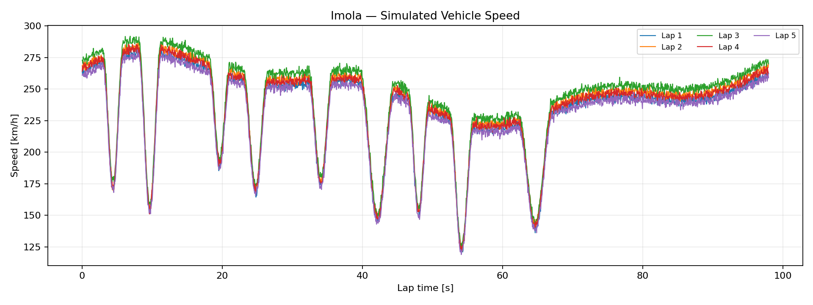
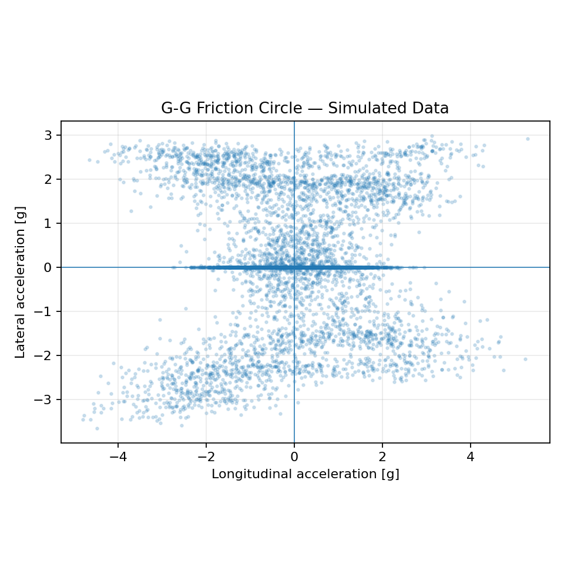
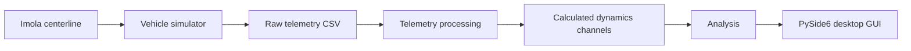

# Vehicle Telemetry & Dynamics — Imola Circuit

> A Python desktop application for automotive telemetry simulation, data analysis and simplified vehicle-dynamics exploration, focused on the Imola Circuit.

[](https://github.com/YOUR_GITHUB_USERNAME/vehicle-telemetry-imola/actions/workflows/tests.yml)
[](https://www.python.org/)
[](LICENSE)

## Overview

This project explores how motorsport telemetry can be processed from raw signals into engineering-oriented channels and visualizations.

The application combines:

- simulated vehicle telemetry;
- numerical processing with NumPy and Pandas;
- simplified vehicle-dynamics calculations;
- Matplotlib visualizations;
- a PySide6 desktop interface;
- automated unit tests.

The default dataset is simulated. It is designed to demonstrate the software architecture and analysis workflow rather than reproduce validated race-engineering data.

## Preview

### Speed trace



### G-G friction circle



## Main features

- Vehicle speed, RPM, throttle, brake and steering analysis
- Longitudinal and lateral acceleration
- G-G friction circle
- Steering kinematics
- Understeer / oversteer gradient estimation
- Tyre slip ratio for all four wheels
- Friction-utilization analysis
- Electrical power, voltage and current monitoring
- Motor-temperature and SOC channels
- Lap and sector analysis
- Simulated telemetry faults and anomalies
- CSV import/export workflow
- Desktop GUI built with PySide6 / Qt
- Plot export to PNG

## Architecture



The code is separated into circuit modelling, vehicle modelling, telemetry generation, dynamics calculations, analysis and GUI widgets.

## Project structure

```text
vehicle-telemetry-imola/
├── app.py
├── README.md
├── LICENSE
├── requirements.txt
├── .gitignore
├── data/
│   ├── simulated/
│   │   ├── imola_telemetry.csv
│   │   └── imola_telemetry_calculated.csv
│   └── real/
│       └── README.md
├── docs/
│   ├── speed_trace.png
│   └── gg_friction_circle.png
├── src/
│   ├── imola.py
│   ├── vehicle_model.py
│   ├── telemetry.py
│   ├── dynamics.py
│   ├── analysis.py
│   ├── io.py
│   ├── theme.py
│   ├── main_window.py
│   └── widgets/
│       ├── track_view.py
│       ├── telemetry_plot.py
│       └── dynamics_plots.py
└── tests/
    ├── test_dynamics.py
    └── test_imola.py
```

## Engineering model

The project uses intentionally simplified planar and kinematic models.

### Longitudinal acceleration

$$a_x = \frac{dv_x}{dt}$$

### Lateral acceleration

$$a_y = v_x r$$

where $v_x$ is longitudinal velocity and $r$ is yaw rate.

### G-G channels

$$a_{x,g}=\frac{a_x}{g}, \qquad a_{y,g}=\frac{a_y}{g}$$

### Friction utilization

$$U=\frac{\sqrt{a_x^2+a_y^2}}{\mu g}$$

### Steering kinematics

$$\delta_{kin}=\arctan(L\kappa), \qquad \kappa=\frac{r}{v_x}$$

### Understeer gradient

The project uses the following sign convention:

$$K_{US}=\frac{\delta-\delta_{kin}}{a_y/g}$$

Positive values represent additional steering demand with lateral load; negative values represent an oversteer tendency. The channel is intended for steady-state/cornering regions and should not be interpreted as a validated transient vehicle-dynamics metric.

### Tyre slip ratio

Using an acceleration-positive convention:

$$\kappa=\frac{R\omega-v_x}{\max(|v_x|,v_{min})}$$

### Electrical power

$$P=VI$$

These equations are implemented as engineering approximations for software development and learning.

## Telemetry schema

Raw telemetry contains normalized channels including:

```text
timestamp_s
lap
lap_time_s
distance_m
x_m
y_m
sector
speed_kmh
rpm
throttle_pct
brake_pct
steering_deg
yaw_rate_dps
voltage_v
current_a
power_kw
motor_temp_c
soc_pct
gear
wheel_speed_fl_rpm
wheel_speed_fr_rpm
wheel_speed_rl_rpm
wheel_speed_rr_rpm
fault
```

Calculated channels are appended by `src/dynamics.py`.

## Getting started

### Requirements

- Python 3.13 recommended
- macOS, Linux or Windows

### Installation

```bash
git clone https://github.com/YOUR_GITHUB_USERNAME/vehicle-telemetry-imola.git
cd vehicle-telemetry-imola
python3 -m venv .venv
source .venv/bin/activate
python3 -m pip install -r requirements.txt
```

On Windows, activate the environment with:

```powershell
.venv\Scripts\activate
```

### Run the application

```bash
python3 app.py
```

### Generate a new simulated telemetry session

```bash
python3 -m src.telemetry
```

### Run tests

```bash
python3 -m unittest discover -s tests -v
```

## Data scope and limitations

The included telemetry and vehicle model are simulated and deliberately simplified.

The Imola centerline is an engineering visualization based on the reference layout used for this project; it is **not survey-grade GPS/GIS data** and should not be treated as an official circuit dataset.

The vehicle-dynamics calculations are educational engineering approximations and have not been validated against a physical vehicle, wind-tunnel data, tyre data or professional motorsport telemetry.

The `data/real/` directory is reserved for private or proprietary telemetry. Real CSV files in that directory are ignored by Git so that private data is not accidentally committed.

## Future development

- Real telemetry adapters for simulator exports
- More robust lap/sector segmentation
- Vehicle parameter configuration files
- Improved tyre and load-transfer models
- Additional driver and vehicle metrics
- Expanded automated test coverage

## Author

**Marco Francavilla**  
Computer Engineering Student — University of Bologna

- GitHub: https://github.com/marckhak
- Focus: software engineering, data analysis, automotive technology and vehicle dynamics

## License

MIT License. See [LICENSE](LICENSE).
